# Team Project: *Group 05*

## Team Members
| Number | Name        | Email(s)                  | CSGitLab Username |
|--------|-------------|---------------------------|-------------------|
| TM1    | Wang Shuhan | shuhan.wang@ucdconnect.ie | @WangShuhan       |
| TM2    | Gu Ruixin   | ruixin.gu@ucdconnect.ie   | @RuixinGu         |     
| TM3    | Rong Yuze   | yuze.rong@ucdconnect.ie   | @22207274         |     
| TM4    | An Ran      | ran.am@ucdconnect.ie      | @RanAnQWQ         |     
| TM5    | Li Siying   | siying.li@ucdconnect.ie   | @siying.li        |     
| TM6    | Shen Jinyan | jinyan.shen@ucdconnect.ie | @Shen_Jinyan      |     
| TM7    | Wan Zitong  | zitong.wan@ucdconnect.ie  | @tong wen         |     
| TM8    | Qin Chenle  | chenle.qin@ucdconnect.ie  | @22207284         |

## Milestone 1 Requirements Analysis
### Distribution of work on this milestone
#### Overall Distribution of Work
| Team Member | TM1 | TM2 | TM3 | TM4 | TM5 | TM6 | TM7 | TM8 |
|-------------|-----|-----|-----|-----|-----|-----|-----|-----|
| Percentage  | 20% | 16% | 13% | 13% | 12% | 12% | 7%  | 7%  |

#### Reflection Statements
| Team Member | Contribution Reflection Statement                                                                                                                                                                                                                                                                                     |
|-------------|-----------------------------------------------------------------------------------------------------------------------------------------------------------------------------------------------------------------------------------------------------------------------------------------------------------------------|
|TM1| <*Required*: Team Leader. Responsible for organizing team meetings, discussing task distribution, and leading the Use Case design. Completed use case descriptions for the Organizer role and designed UI diagrams for special scenarios. Responsible for final compilation and review of all project documentation.> |
|TM2| <*Required*: Designing the domain model diagrams; Reviewing, and supplementing the use case descriptions and UI diagrams for the Admin and User roles. Compiled the final README file.>                                                                                                                               |
|TM3| <*Required*: Completing the detailed descriptions of the domain model. Assisted with the diagram design.>                                                                                                                                                                                                             |
|TM4| <*Required*: Drew a use case diagram and completed the System Glossary.>                                                                                                                                                                                                                                              |
|TM5| <*Required*: Completed half of the UI diagram and participated in the design of the use case description.>                                                                                                                                                                                                            |
|TM6| <*Required*: Completed half of the UI diagram and participated in the design of the use case description.>                                                                                                                                                                                                                                                                                  |
|TM7| <*Required*: The User section in the use case description.>                                                                                                                                                                                                                                                           |
|TM8| <*Required*: The Admin section in the use case description.>                                                                                                                                                                                                                                                          |

# Requirements Analysis

This is the requirements analysis or business modelling for the restaurant application.

## Domain Model
[Domain Model Introduction](DomainModel/DomainModelIntroduction.md)
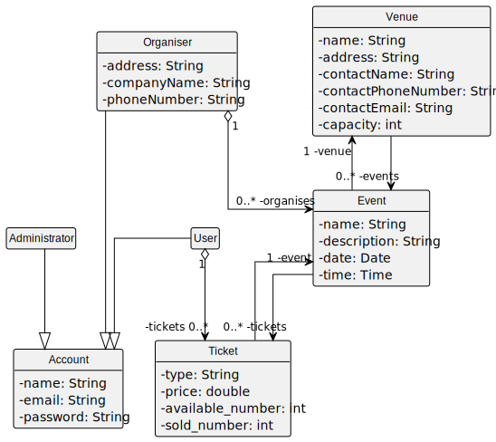

## Use Case Diagram

The use cases are shown in this diagram

## System Glossary

| Term        | Description                                                                                   |
|-------------|-----------------------------------------------------------------------------------------------|
| Administrator | A user role responsible for managing the entire system including user accounts and events.   |
| Organiser   | A user role that manages events, including creating and editing them and managing venues.     |
| User        | A regular user who can purchase tickets and manage their own account details.                 |
| Account     | Stores personal or organizational information of users, organizers, and administrators,  including names, email addresses, passwords, and more. |
| Venue       | A location where events are held, with specific attributes like name, address, and capacity.  |
| Event       | An occurrence that has a specific date, time, and place, with ticketing details associated.    |
| Ticket      | A reservation for an event that includes details about the seat type and price.                |

## Use Case Descriptions

This includes the following use cases:

### Administrator Use Cases
1. [View All Events](UseCase/Administrator/01-view_all_events.md)
2. [View Events History](UseCase/Administrator/02-view_events_history.md)
3. [Delete Event](UseCase/Administrator/03-delete_event.md)
4. [View All Venues](UseCase/Administrator/04-view_all_venues.md)
5. [View Venue Usage History](UseCase/Administrator/05-view_venue_usage_history.md)
6. [Delete Venue](UseCase/Administrator/06-delete_venue.md)
7. [View All Accounts](UseCase/Administrator/07-view_all_accounts.md)
8. [Create User Account](UseCase/Administrator/08-create_user_account.md)
9. [Create Organizer Account](UseCase/Administrator/09-create_organizer_account.md)
10. [Create Administrator Account](UseCase/Administrator/10-create_administrator_account.md)
11. [Edit Account Permission](UseCase/Administrator/11-edit_account_permission.md)
12. [Edit User Account](UseCase/Administrator/12-edit_user_account.md)
13. [Edit Organizer Account](UseCase/Administrator/13-edit_organizer_account.md)
14. [Edit Administrator Account](UseCase/Administrator/14-edit_administrator_account.md)
15. [Disable Account](UseCase/Administrator/15-disable_account.md)
16. [Delete Account](UseCase/Administrator/16-delete_account.md)

### Organizer Use Cases
17. [View All Events](UseCase/Organizer/17-view_all_events.md)
18. [List Events](UseCase/Organizer/18-list_events.md)
19. [Create Event](UseCase/Organizer/19-create_event.md)
20. [Edit Event](UseCase/Organizer/20-edit_event.md)
21. [Delete Event](UseCase/Organizer/21-delete_event.md)
22. [View Event Details](UseCase/Organizer/22-view_event_details.md)
23. [View Event Registrations](UseCase/Organizer/23-view_event_registrations.md)
24. [Display Date](UseCase/Organizer/24-display_date.md)
25. [List Venues](UseCase/Organizer/25-list_venues.md)
26. [Create Venue](UseCase/Organizer/26-create_venue.md)
27. [Edit Venue](UseCase/Organizer/27-edit_venue.md)
28. [View Venue Details](UseCase/Organizer/28-view_venue_details.md)
29. [View Venue Bookings](UseCase/Organizer/29-view_venue_bookings.md)
30. [View Organizer Account](UseCase/Organizer/30-view_organizer_account.md)
31. [Update Organizer Account](UseCase/Organizer/31-update_organizer_account.md)

### User Use Cases
32. [Create User Account](UseCase/User/32-create_user_account.md)
33. [Display Date](UseCase/User/33-display_date.md)
34. [View All Events](UseCase/User/34-view_all_events.md)
35. [View User Account](UseCase/User/35-view_user_account.md)
36. [List Upcoming Events](UseCase/User/36-list_upcoming_events.md)
37. [View Event Details (User)](UseCase/User/37-view_event_details_user.md)
38. [Search and Filter Events](UseCase/User/38-search_filter_events.md)
39. [Purchase Ticket](UseCase/User/39-purchase_ticket.md)
40. [View Purchased Tickets](UseCase/User/40-view_purchased_tickets.md)
41. [Cancel Ticket](UseCase/User/41-cancel_ticket.md)

## UI Prototypes/Sketches

| Page Name                                   | Image                                                                         |
|---------------------------------------------|-------------------------------------------------------------------------------|
| Use Case 1: "View All Events"               | 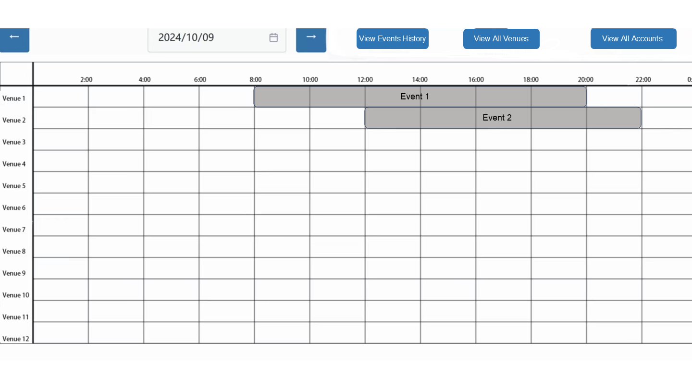                           |
| Use Case 2: "View Events History"           |                    |
| Use Case 3: "Delete Event"                  | 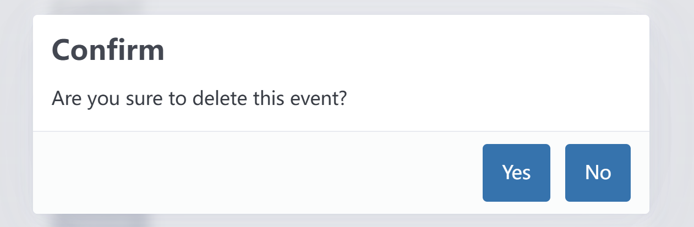                                 |
| Use Case 4: "View All Venues"               | 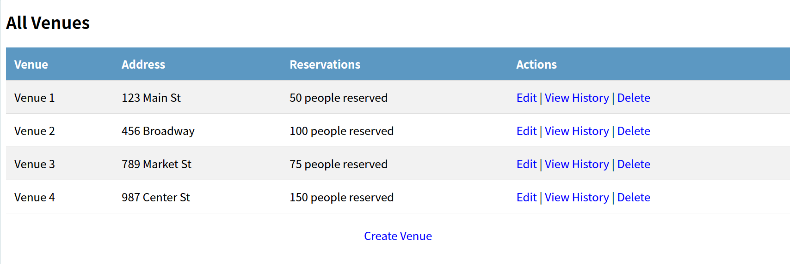                           |
| Use Case 5: "View Venue Usage History"      |          |
| Use Case 6: "Delete Venue"                  |                                  |
| Use Case 7: "View All Accounts"             |                        |
| Use Case 8: "Create User Account"           |                    |
| Use Case 9: "Create Organizer Account"      |          |
| Use Case 10: "Create Administrator Account" |  |
| Use Case 11: "Edit Account Permission"      |            |
| Use Case 12: "Edit User Account"            |                        |
| Use Case 13: "Edit Organizer Account"       |              |
| Use Case 14: "Edit Administrator Account"   | 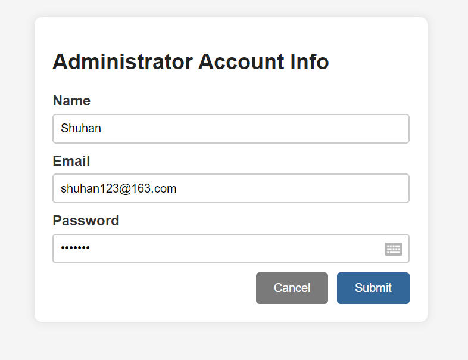     |
| Use Case 15: "Disable Account"              |                            |
| Use Case 16: "Delete Account"               |                              |
| Use Case 17: "View All Events (Organizer)"  | 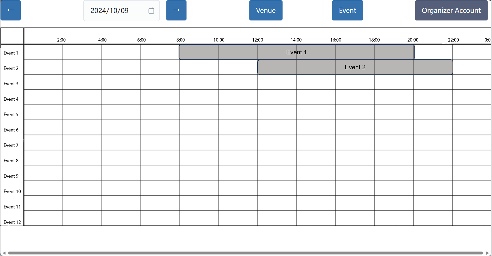                       |
| Use Case 18: "List Events"                  |                                 |
| Use Case 19: "Create Event"                 |                              |
| Use Case 20: "Edit Event"                   |                                  |
| Use Case 21: "Delete Event"                 |                              |
| Use Case 22: "View Event Details"           | 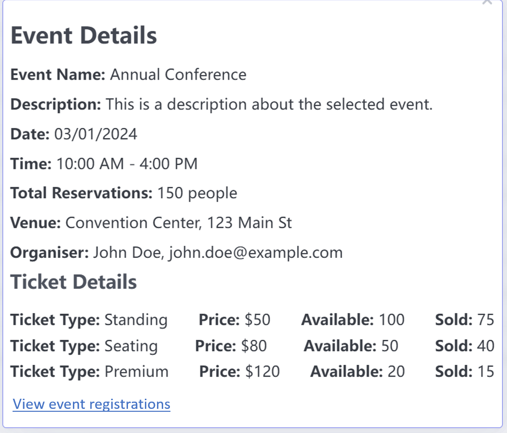                 |
| Use Case 23: "View Event Registrations"     |      |
| Use Case 24: "Display Date"                 |                              |
| Use Case 25: "List Venues"                  |                                |
| Use Case 26: "Create Venue"                 | 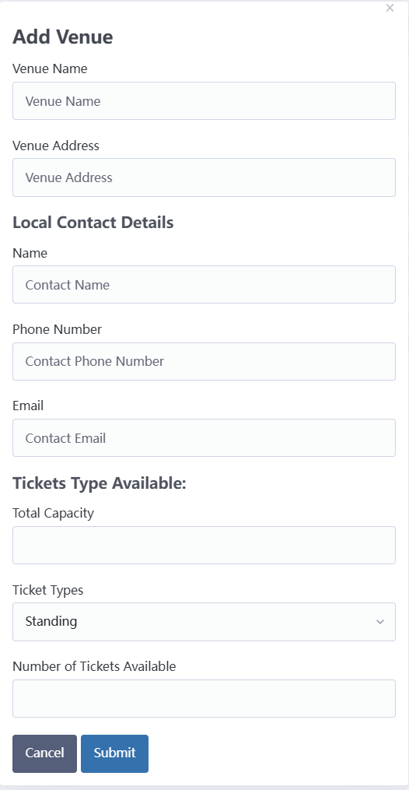                             |
| Use Case 27: "Edit Venue"                   |                                  |
| Use Case 28: "View Venue Details"           |                  |
| Use Case 29: "View Venue Bookings"          | 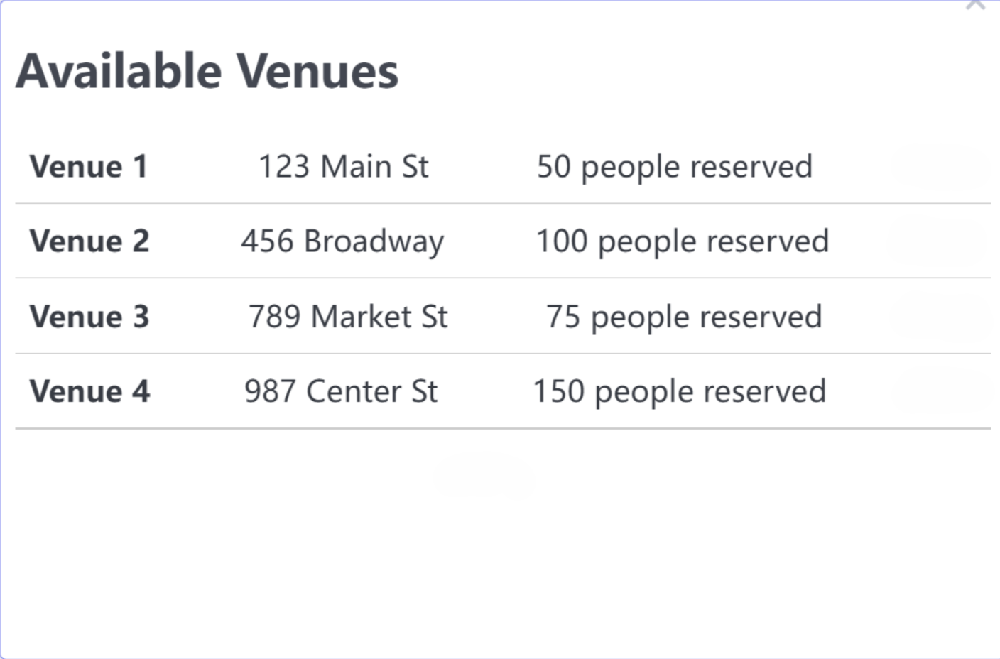               |
| Use Case 30: "View Organizer Account"       |          |
| Use Case 31: "Update Organizer Account"     |      |
| Use Case 32: "Create User Account (User)"   | 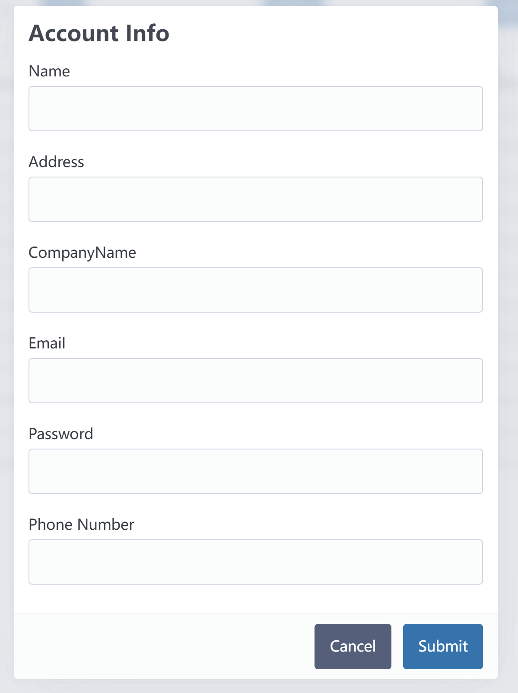                    |
| Use Case 33: "Display Date"                 |                                   |
| Use Case 34: "View All Events"              |                             |
| Use Case 35: "View User Account"            | 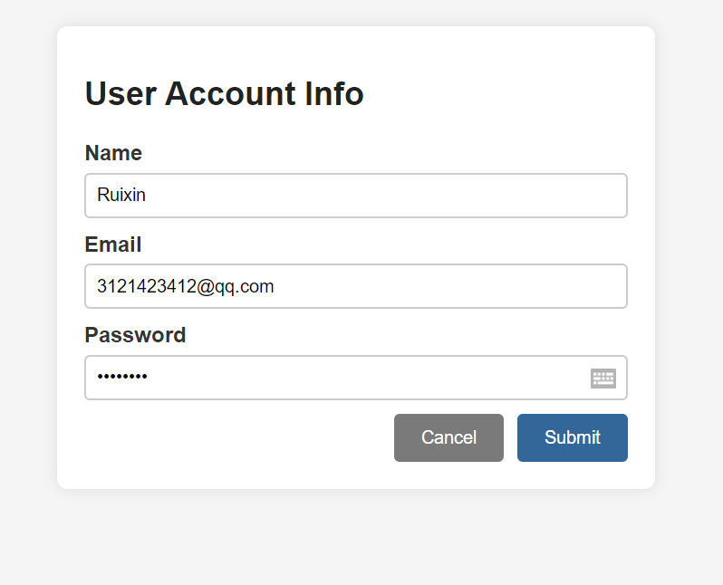                        |
| Use Case 36: "List Upcoming Events"         | 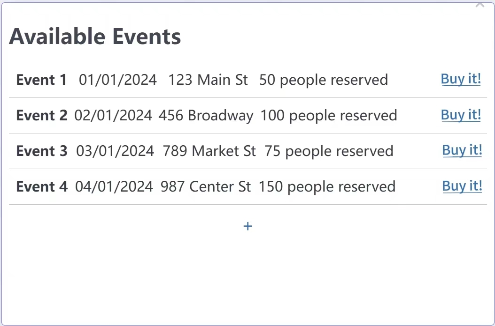                  |
| Use Case 37: "View Event Details (User)"    |                  |
| Use Case 38: "Search and Filter Events"     |               |
| Use Case 39: "Purchase Ticket"              |                             |
| Use Case 40: "View Purchased Tickets"       | 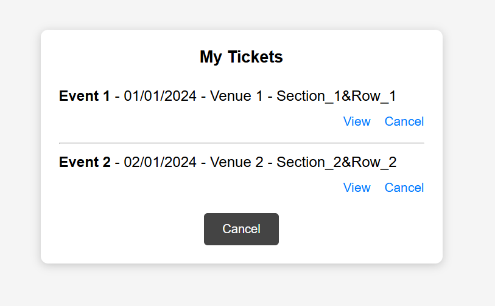              |
| Use Case 41: "Cancel Ticket"                |                                 |

#### Task Allocation
| Item                                        | Primary Author | Contributor | Contributor | Reviewer |
|---------------------------------------------|----------------|-------------|-------------|----------|
| Use Case Diagram                            | TM4            |             |             | TM2      |
| Domain Model                                | TM2            | TM3         | TM1         | TM4      |
| System Golssary                             | TM3            |             |             | TM3      |
| UI Prototypes                               | TM5&6          | TM2         | TM1         | TM1      |
| Use Case 1: "View All Events"               | TM1            | TM2         |             | TM1      |
| Use Case 2: "View Events History"           | TM8            | TM2         |             | TM1      |
| Use Case 3: "Delete Event"                  | TM2            |             |             | TM1      |
| Use Case 4: "View All Venues"               | TM8            | TM2         |             | TM1      |
| Use Case 5: "View Venue Usage History"      | TM8            | TM2         |             | TM1      |
| Use Case 6: "Delete Venue"                  | TM8            | TM2         |             | TM1      |
| Use Case 7: "View All Accounts"             | TM8            | TM2         |             | TM1      |
| Use Case 8: "Create User Account"           | TM2            |             |             | TM1      |
| Use Case 9: "Create Organizer Account"      | TM2            |             |             | TM1      |
| Use Case 10: "Create Administrator Account" | TM2            |             |             | TM1      |
| Use Case 11: "Edit Account Permission"      | TM8            | TM2         |             | TM1      |
| Use Case 12: "Edit User Account"            | TM8            | TM2         |             | TM1      |
| Use Case 13: "Edit Organizer Account"       | TM8            | TM2         |             | TM1      |
| Use Case 14: "Edit Administrator Account"   | TM2            |             |             | TM1      |
| Use Case 15: "Disable Account"              | TM8            | TM2         |             | TM1      |
| Use Case 16: "Delete Account"               | TM2            |             |             | TM1      |
| Use Case 17: "View All Events"              | TM1            |             |             | TM2      |
| Use Case 18: "List Events"                  | TM1            |             |             | TM2      |
| Use Case 19: "Create Event"                 | TM1            |             |             | TM2      |
| Use Case 20: "Edit Event"                   | TM1            |             |             | TM2      |
| Use Case 21: "Delete Event"                 | TM1            |             |             | TM2      |
| Use Case 22: "View Event Details"           | TM1            |             |             | TM2      |
| Use Case 23: "View Event Registrations"     | TM1            |             |             | TM2      |
| Use Case 24: "Display Date"                 | TM1            |             |             | TM2      |
| Use Case 25: "List Venues"                  | TM1            |             |             | TM2      |
| Use Case 26: "Create Venue"                 | TM1            |             |             | TM2      |
| Use Case 27: "Edit Venue"                   | TM1            |             |             | TM2      |
| Use Case 28: "View Venue Details"           | TM1            |             |             | TM2      |
| Use Case 29: "View Venue Bookings"          | TM1            |             |             | TM2      |
| Use Case 30: "View Organizer Account"       | TM1            |             |             | TM2      |
| Use Case 31: "Update Organizer Account"     | TM1            |             |             | TM2      |
| Use Case 32: "Create User Account"          | TM7            | TM1         |             | TM2      |
| Use Case 33: "Display Date"                 | TM1            |             |             | TM2      |
| Use Case 34: "View All Events"              | TM1            |             |             | TM2      |
| Use Case 35: "View User Account"            | TM7            | TM1         |             | TM2      |
| Use Case 36: "List Upcoming Events"         | TM7            |             |             | TM2      |
| Use Case 37: "View Event Details (User)"    | TM7            |             |             | TM2      |
| Use Case 38: "Search Filter Events"         | TM7            |             |             | TM2      |
| Use Case 39: "Purchase Ticket"              | TM7            |             |             | TM2      |
| Use Case 40: "View Purchased Tickets"       | TM7            |             |             | TM2      |
| Use Case 41: "Cancel Ticket"                | TM7            |             |             | TM2      |

