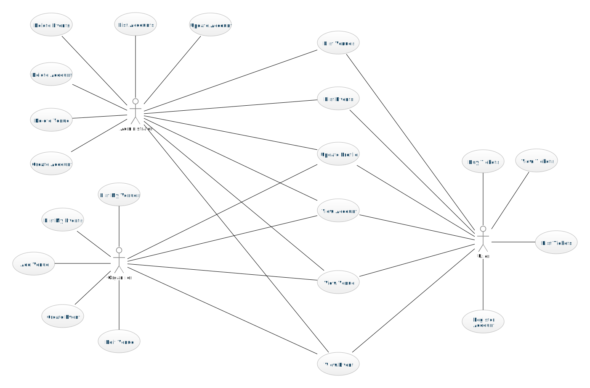

# Team Project: *Group 05*

## Team Members
| Number | Name          | Email(s)                           | CSGitLab Username |
|--------|---------------|------------------------------------|-------------------|
| TM1    | Wang Shuhan   | shuhan.wang@ucdconnect.ie          | @WangShuhan       |
| TM2    | Gu   Ruixin   | ruixin.gu@ucdconnect.ie            | @RuixinGu         |     
| TM3    | Team Member 3 | tm3@ucdconnect.ie, personal@qq.com | @22201003         |     
| TM4    | Team Member 4 | tm4@ucdconnect.ie                  | @22201004         |     
| TM5    | Team Member 5 | tm5@ucdconnect.ie                  | @22201005         |     
| TM6    | Team Member 6 | tm6@ucdconnect.ie                  | @22201006         |     
| TM7    | Team Member 7 | tm7@ucdconnect.ie                  | @22201007         |     
| TM8    | Team Member 8 | tm8@ucdconnect.ie                  | @22201008         |

# Requirements Analysis

This is the requirements analysis or business modelling for the restaurant application.

## Use Case Descriptions

This includes the following use cases:

1. [Use Case 1](01-name.md)
2. [Use Case 2](02-name.md)
3. [Use Case 3](03-name.md)
4. [Use Case 4](04-name.md)
5. [Use Case 5](05-name.md)

## Use Case Diagram

The use cases are shown in this diagram

## Domain Model
A Introduction to Domain model:[Click](./DomainModel/DomainModelIntroduction.md)

## System Glossary

| Term        | Description                                                                                   |
|-------------|-----------------------------------------------------------------------------------------------|
| Administrator | A user role responsible for managing the entire system including user accounts and events.   |
| Organiser   | A user role that manages events, including creating and editing them and managing venues.     |
| User        | A regular user who can purchase tickets and manage their own account details.                 |
| Account     | Stores personal or organizational information of users, organizers, and administrators,  including names, email addresses, passwords, and more. |
| Venue       | A location where events are held, with specific attributes like name, address, and capacity.  |
| Event       | An occurrence that has a specific date, time, and place, with ticketing details associated.    |
| Ticket      | A reservation for an event that includes details about the seat type and price.                |

## UI Prototypes/Sketches
1.Administrator Page

| Page Name                     | Image                                            |
|-------------------------------|--------------------------------------------------|
| Create Organizer Account Page |  |

## Milestone 1 Requirements Analysis

### Distribution of work on this milestone
#### Overall Distribution of Work
| Team Member | TM1 | TM2 | TM3 | TM4 | TM5 | TM6 | TM7 | TM8 |
|-------------|-----|-----|-----|-----|-----|-----|-----|-----|
| Percentage  | 12% | 12% | 12% | 12% | 12% | 12% | 12% | 12% |
#### Task Allocation
| Item               | Primary Author | Contributor | Contributor | Reviewer |
|--------------------|-----|-----|-----|-----|
| Use Case Diagram   | TM1 |     |     | TM2 |
| Domain Model       | TM2 | TM3 | TM1 | TM4 |
| System Golssary    | TM3 |     |     | TM1 |
| UI Prototypes      | TM4 | TM2 | TM1 | TM3 |
| Use Case 1: "Name" | TM4 |     |     | TM3 |
| Use Case 2: "Name" | TM1 |     |     | TM4 |
| Use Case 3: "Name" | TM2 |     |     | TM1 |
| Use Case 4: "Name" | TM3 |     |     | TM2 |
| Use Case N: "Name" | TM4 |     |     | TM3 |

#### Reflection Statements
| Team Member | Contribution Reflection Statement |
|-------------|-------------------|
|TM1| <*Required*: The percentage data is unlikely to tell the whole story about your contribution. Write a brief statement explaining and reflecting on your contribution to this phase of the project.> |
|TM2| <*Required*: The percentage data is unlikely to tell the whole story about your contribution. Write a brief statement explaining and reflecting on your contribution to this phase of the project.> |
|TM3| <*Required*: The percentage data is unlikely to tell the whole story about your contribution. Write a brief statement explaining and reflecting on your contribution to this phase of the project.> |
|TM4| <*Required*: The percentage data is unlikely to tell the whole story about your contribution. Write a brief statement explaining and reflecting on your contribution to this phase of the project.> |
|TM5| <*Required*: The percentage data is unlikely to tell the whole story about your contribution. Write a brief statement explaining and reflecting on your contribution to this phase of the project.> |
|TM6| <*Required*: The percentage data is unlikely to tell the whole story about your contribution. Write a brief statement explaining and reflecting on your contribution to this phase of the project.> |
|TM7| <*Required*: The percentage data is unlikely to tell the whole story about your contribution. Write a brief statement explaining and reflecting on your contribution to this phase of the project.> |
|TM8| <*Required*: The percentage data is unlikely to tell the whole story about your contribution. Write a brief statement explaining and reflecting on your contribution to this phase of the project.> |

