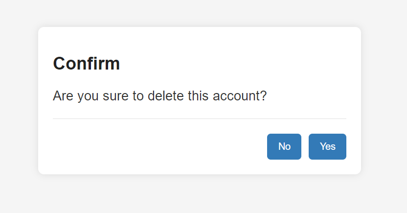

# Use Case: Delete Account

## Description
- This use case allows an administrator to delete an existing account from the system.

## Actors
- Administrator

## Triggers
- The administrator decides to remove an account (user, organizer or administrator) from the system.

## Preconditions
- The administrator is on view all accounts page(7-view_all_accounts.png).

## Postconditions
- The system update the view all accounts page(7-view_all_accounts.png) with this account deleted.

## Courses of Events

### 01 - Basic course of events -

#### Course of Events
- The administrator selects an account to delete on view all accounts page(7-view_all_accounts.png).
- The system asks the administrator to confirm.
- The administrator selects **Yes**.
- The system update the view all accounts page(7-view_all_accounts.png) with this account deleted.

### 02 - Alternate course of events -

#### Do Not Delete
- The administrator selects an account to delete on view all accounts page(7-view_all_accounts.png).
- The system asks the administrator to confirm.
- The administrator selects **No**.
- The system returns to the view all accounts page(7-view_all_accounts.png) with no changes.

#### Event Not Found
- The administrator tries to delete an event that no longer exists.
- The system displays an error message.

### Related UI Prototypes

## Data Outcome
- **DELETE** The selected accound will be deleted from the system
- **READ** The selected accound deleted message will be read and display
