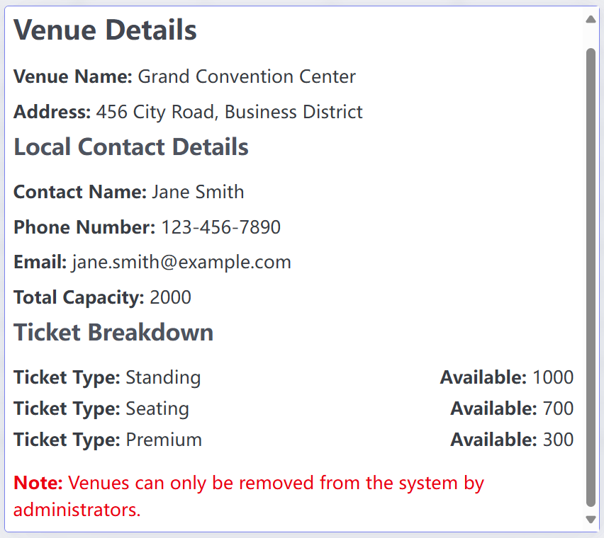

# View Venue Details Use Case

## Description
This use case allows a user to view the detailed information of a specific venue, such as the venue name, address, capacity, and contact information.

## Actors
- Administrator, Organizer, User

## Triggers
- The organizer wants to see the details of a specific venue.

## Preconditions
- The administrator is on the list venues page (04-view_all_venues.png) or view event detail page(22-view_event_details.png).
- The organizer is on the list venues page (25-view_all_venues.png) or view event detail page(22-view_event_details.png).
- The user is on ticket list page(40-view_purchased_tickets.png) or view event detail page(43-view_event_details.png).

## Postconditions
- The system turn to view venue details page(28-view_venue_details.png) which displays the detailed information of the selected venue.

## Courses of Events

### 01 - Basic course of events

#### Course of Events
1. The administrator, organizer or user click one venue from different page. 
2. The system turn to view venue details page(28-view_venue_details.png) which displays the venue details, including:
   - Venue Name
   - Address
   - Capacity
   - Contact Information (name, phone, email)

### 02 - Alternate course of events

#### Venue Not Found
- If the selected venue does not exist, the system displays an error message and prompts the organizer to select a valid venue.

## Exceptions
- **System Error**: If a system error occurs while retrieving the venue details, the system displays an error message and prompts the organizer to try again later.

#### Related UI Prototypes
| View Venue Details Page |
| --- |
|  |
