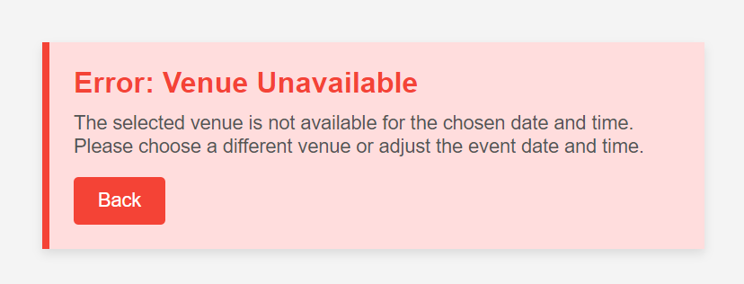

# Use Case:Create Event

## Description
This use case allows an organizer to create a new event to the system by providing event details such as name, date, time, and venue.

## Actors
- Organizer

## Triggers
- The organizer wants to create a new event to be hosted at a specific venue.

## Preconditions
- The organizer is on the list my events page (18-list_my_events.png).
- At least one venue is available in the system.

## Postconditions
- The system updates the list my events page (18-list_my_events.png) with the added events.
## Courses of Events

### 01 - Basic course of events

#### Course of Events
1. The organizer selects the "+" option from the list my events page (18-list_my_events.png).
2. The system turn to create event page (19-create_event.png) which displays a form to enter event details, including:
   - Event Name
   - Date and Time
   - Venue
   - Description
   - Ticket Information (types, prices, quantity)
3. The organizer fills in the required details and clicks "Submit".
4. The system updates the list of upcoming events and return to the list my events page (18-list_my_events.png).

### 02 - Alternate course of events

#### Missing Required Fields
- If the organizer submits the form with missing required fields (e.g., event name or date), the system highlights the missing fields and prompts the organizer to provide the necessary information.

#### Venue Unavailable
- If the selected venue is not available for the chosen date and time, the system displays an error message and prompts the organizer to choose a different venue or date.

## Exceptions
- **System Error**: If a system error occurs while saving the event, the system displays an error message and prompts the organizer to try again later.

### **Related UI Prototypes**
| Create Event Page                                             |
|---------------------------------------------------------------|
|        |
| Error: Venue Unavaliable                                      |
|  |                                                        |

## Data Outcome
- **CREATE** - A new event will be created and added to the system.
- **READ** - The details of the newly created event will be read and displayed.
