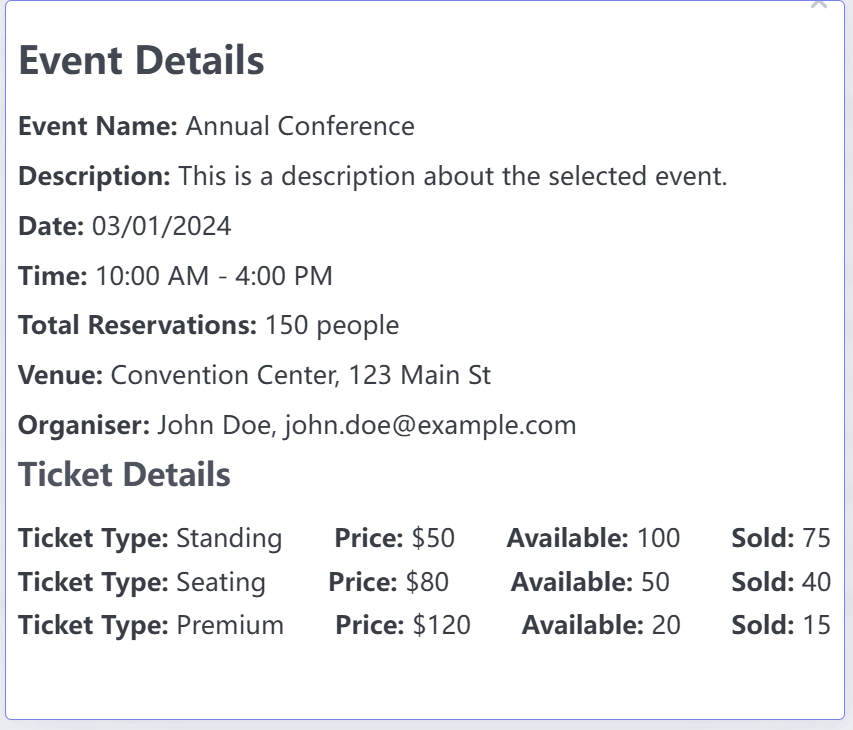

# Use Case: View Event Details

## Description
This use case allows an administrator, organizer or user to view detailed information about a specific event in the event management system.
## Actors
- Administrator, Organizer, User

## Triggers
- This use case is triggered when the user wants to see more details about a specific event.

## Preconditions
- The administrator is on their main page(01-view_all_events.png) or events history page(02-view_events_history.png).
- The organizer is on their main page(17-view_all_events.png) or their events list page (18-list_my_events.png).
- The user is on their main page(34-view_all_events.png).

## Postconditions
- The system displays the event details page for the selected event.

## Courses of Events

### 01 - Basic course of events

#### Course of Events
1. The administrator, organizer or user click on an event in the table or list.
3. The system displays the event details page(22-view_event_details.png), including:
   - Event Name
   - Date and Time
   - Venue
   - Description
   - Ticket Information (availability, types, prices, number of tickets sold, remaining tickets)

   
### 02 - Alternate course of events

#### Event Not Found
- If the selected event does not exist, the system displays an error message and prompts the organizer to select a valid event.

## Exceptions
- **System Error**: If a system error occurs while retrieving the event details, the system displays an error message and prompts the organizer to try again later.

#### Related UI Prototypes-- Administrator, Organizer
| View Event Details Page |
| --- |
|  |

#### Related UI Prototypes-- User
| View Event Details Page                                        |
|----------------------------------------------------------------|
|  |
