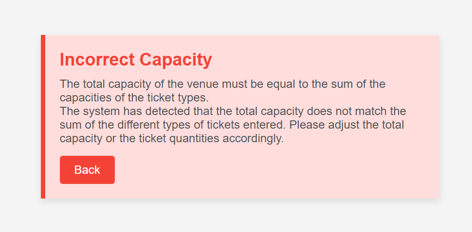
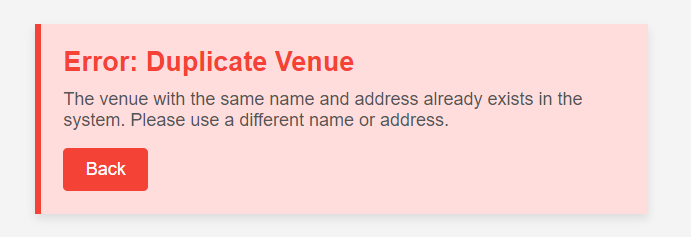

# Use Case: Edit Venue

## Description
This use case allows an organizer to edit the details of an existing venue.

## Actors
- Administrator, Organizer

## Triggers
- The organizer or administrator wants to update information about a venue.

## Preconditions
- The organizer is on my list venues page (25-list_my_venues.png).
- The administrator is on the all venues page (04-view_all_venues.png).

## Postconditions
- The organizer is shown the updated list venues page (25-list_my_venues.png).
- The administrator is shown the all venues page (04-view_all_venues.png).

## Courses of Events

### 01 - Basic course of events

#### Course of Events
1. The organiser or administrator selects the edit venue functionality.
2. The system displays a form with the current venue details (27-edit_venue.png).
3. The organiser or administrator updates the information (Name, Address, Ticket Types(ticketTypeName, number),Contact information (name, phone, email)).
4. The organiser or administrator clicks "Save Changes" to confirm the modifications.
5. The system updates the list of upcoming events and return to the list venues page (25-list_my_venues.png).

### 02 - Alternate course of events

#### Incorrect Capacity
- The organiser or administrator selects the add venue functionality
- The system displays the add venue page (11-add-venue) page
- The organiser or administrator enters the details of the venue
- The system warns the organiser or administrator that the total capacity of the venue does not match the sum of the different types of tickets (Alternative/add_venue-capacity.png)
- The organiser or administrator clicks OK
- The system returns to step 2 of the use case

#### Duplicate Venue
- The organiser or administrator selects the add venue functionality
- The system displays the add venue page (11-add-venue) page
- The organiser or administrator enters the details of the venue
- The displays an error message and prevents saving the duplicate entry(add_venue-duplicate.png).
- The organiser or administrator clicks OK
- The system returns to step 2 of the use case

## Exceptions
- **System Error**: If a system error occurs while saving the updated venue details, the system displays an error message and prompts the organizer to try again later.

## Related UI Prototypes
| Edit Venue Page                                                                                   |
|---------------------------------------------------------------------------------------------------|
|                                                |
| Error: Duplicate Venue                                               |
|   |
| Error: Duplicate Venue                                               |
|  |

## Data Outcome
- **READ** - The details of the venue will be read and displayed.
- **UPDATE** - The details of the venue will be updated.  
