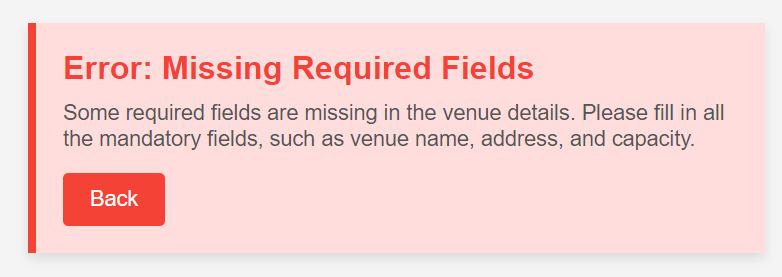

# Use Case: Edit Venue

## Description
This use case allows an organizer to edit the details of an existing venue.

## Actors
- Organizer

## Triggers
- The organizer wants to update information about a venue.

## Preconditions
- The organizer is on list venues page (25-view_all_venues.png).

## Postconditions
- The organizer is shown the updated list venues page (25-view_all_venues.png).

## Courses of Events

### 01 - Basic course of events

#### Course of Events
1. The organizer selects the "Edit" option of a venue from list venues page (25-view_all_venues.png).
2. The system displays a form with the current venue details (27-edit_venue.png).
3. The organizer updates the information.
4.  The organizer clicks "Save Changes" to confirm the modifications.
5. The system updates the list of upcoming events and return to the list venues page (25-view_all_venues.png).

### 02 - Alternate course of events
#### Invalid Ticket Capacity
- If the total capacity is set to a value lower than the total tickets already sold for events at this venue, the system displays an error message and prompts the organizer to adjust the capacity or cancel certain tickets.

#### Missing Required Fields
- If the organizer submits the form with missing required fields (e.g., venue name or capacity), the system highlights the missing fields and prompts the organizer to provide the necessary information.

## Exceptions
- **System Error**: If a system error occurs while saving the updated venue details, the system displays an error message and prompts the organizer to try again later.

## Related UI Prototypes
| Edit Venue Page                                                                                   |
|---------------------------------------------------------------------------------------------------|
|                                                |
| Error: Invalid Ticket Capacity                                                                    |
|  |  
| Error: Missing Required Fields                                                                         |
|  |

## Data Outcome
- **READ** - The details of the venue will be read and displayed.
- **UPDATE** - The details of the venue will be updated.  
