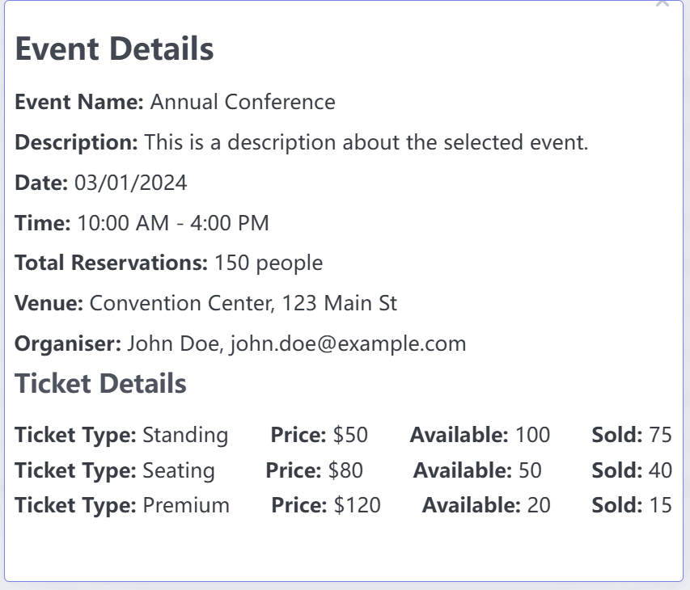

# View Event Details Use Case

## Description
This use case allows an organizer to view detailed information about a specific event in the event management system, such as the event name, date, time, venue, description, and ticket sales status.

## Actors
- Organizer

## Triggers
- The organizer wants to see more details about a specific event they have created, including ticket sales information.

## Preconditions
- The organizer must be logged into the system.
- The event must exist in the system.

## Postconditions
- The system displays the event details for the selected event.

## Courses of Events

### 01 - Basic course of events

#### Course of Events
1. The organizer selects the "View Event Details" option from the list of events.
2. The system retrieves the details of the selected event.
3. The system displays the event details, including:
   - Event Name
   - Date and Time
   - Venue
   - Description
   - Ticket Information (availability, types, prices, number of tickets sold, remaining tickets)

### 02 - Alternate course of events

#### Event Not Found
- If the selected event does not exist, the system displays an error message and prompts the organizer to select a valid event.

## Exceptions
- **System Error**: If a system error occurs while retrieving the event details, the system displays an error message and prompts the organizer to try again later.

#### Related UI Prototypes
| View Event Details Page |
| --- |
|  |