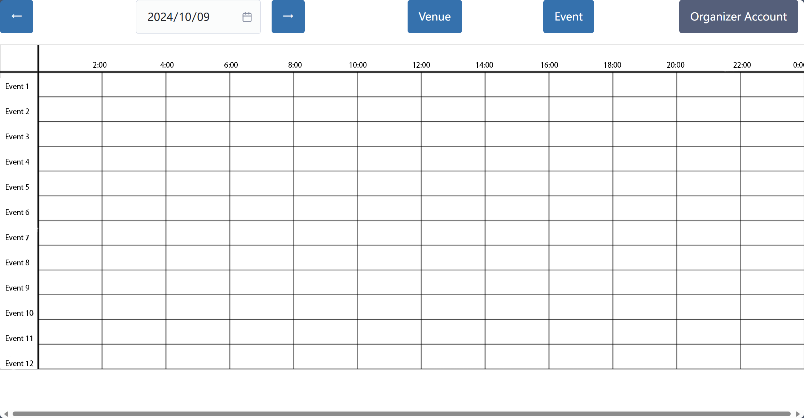

# View Venue Bookings Use Case

### **Actor**: Organizer

### **Description**
This use case allows an organizer to view the booking details for a specific venue, focusing on the events scheduled at that venue, including dates, times, and event names.

### **Trigger**
The organizer wants to see the booking details for a specific venue to check its availability or manage events.

### **Preconditions**
- The organizer must be logged into the system.
- The venue must exist in the system.

### **Postconditions**
- The system displays the booking details for the selected venue, including all events scheduled at that venue.

### **Basic Flow**
1. The organizer selects the "View Venue Bookings" option from the venue management menu.
2. The system retrieves the booking details of the selected venue.
3. The system displays the booking details, including:
    - Venue Name
    - List of Events (event names, dates, and times)

### **Alternate Flow**
- **Venue Not Found**: If the selected venue does not exist, the system displays an error message and prompts the organizer to select a valid venue.

### **Exceptions**
- **System Error**: If a system error occurs while retrieving the booking details, the system displays an error message and prompts the organizer to try again later.

### **Related UI Prototypes**
### **Related UI Prototypes**
||