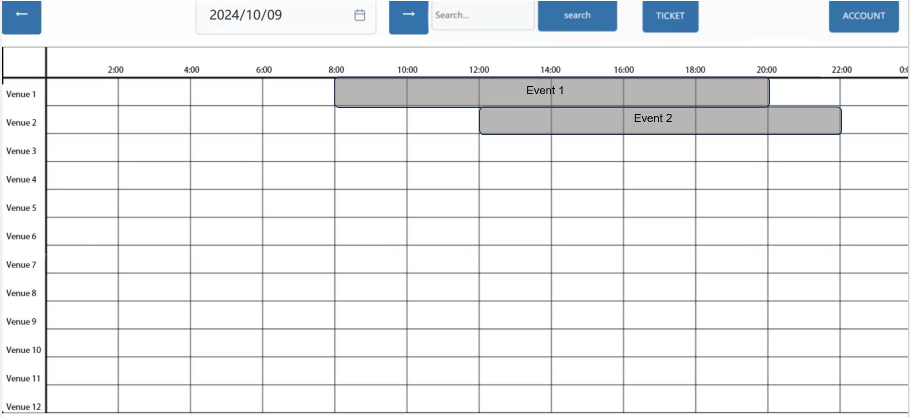

# View All Events Use Case

## Description
This use case allows a user to view all events scheduled in the event management system. The events are displayed in a tabular format, showing event names, time slots, and available seats for a selected date. The user can use navigation buttons to view events for different dates and filter the events based on criteria such as event type or venue.

## Actors
- User

## Triggers
- The user wants to see a complete overview of all events scheduled on a specific date.

## Preconditions
- The user must be logged into the system.

## Postconditions
- The system displays all events in a tabular format for the selected date, showing time slots, event names, and available seats.

## Courses of Events

### 01 - Basic course of events

#### Course of Events
1. After logging in, the user is presented with the 'View All Events' page, displaying a table of all scheduled events for the current date.
2. The system displays a table showing all events scheduled for the current date.
3. The user can see the following details in the table:
    - Event Name
    - Time Slots (e.g., 2:00, 4:00, 6:00, etc.)
    - Available Seats for Each Event
    - Event Type (e.g., Concert, Sports, Theater)
    - Venue Name
4. The user can use the navigation buttons (left, right) or date picker to change the date and view events scheduled on different dates.
5. The user can also apply filters to narrow down events based on event type or venue.
6. If there are no events for the selected date, the system displays an empty table or a "No Events Scheduled" message.

### 02 - Alternate course of events

#### No Events Scheduled
- If there are no events scheduled for the selected date, the system displays an empty table and shows a message such as "No Events Scheduled" to the user.

#### Invalid Date Selection
- If the selected date is invalid or out of range (e.g., a past date where the events have been deleted), the system displays an error message and prompts the user to select a valid date.

## Exceptions
- **System Error**: If a system error occurs while loading the events, the system displays an error message and prompts the user to try again later.

## Related UI Prototypes
| View All Events Page                                     |
|----------------------------------------------------------|
|  |
