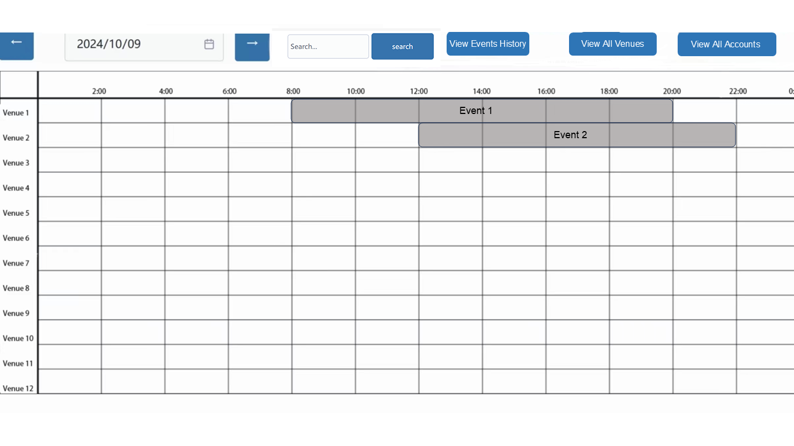
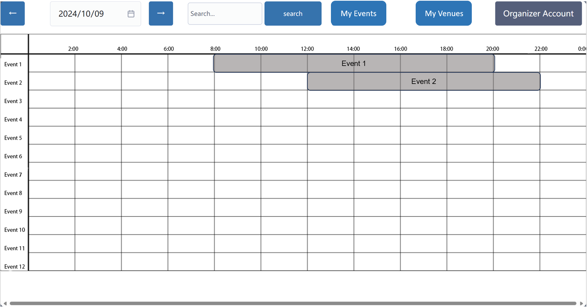

# 00 Login

## Basic Course of Events
- 1.The user opens the application.
- 2.The system presents a login page and prompt the user to enter their email and password
- 3.The user enters their credentials
- 4.The system displays the main page of the system. The administrator is on their main page(01-view_all_events.png). The organizer is on their main page(17-view_all_events.png). The user is on their main page(34-view_all_events.png).

### Sequence Diagram

## Alternate Course of Events
- 1.The user opens the application.
- 2.The system presents a login page and prompt the user to enter their email and password
- 3.The user enters their credentials
- 4.The system informs the user that their combination of username and password was incorrect and returns to the log in page

### Sequence Diagram-- Alternate Course of Events

## UI Sketches
This is the page that the user must be on at the start to complete the use case.
 
### Main Page
#### Administrator

#### Organizer

#### User
 
