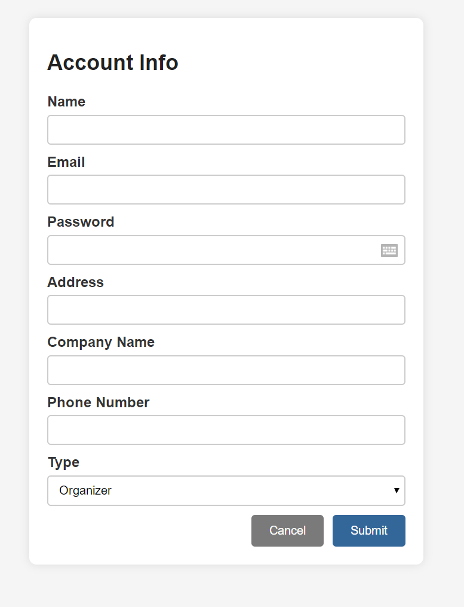
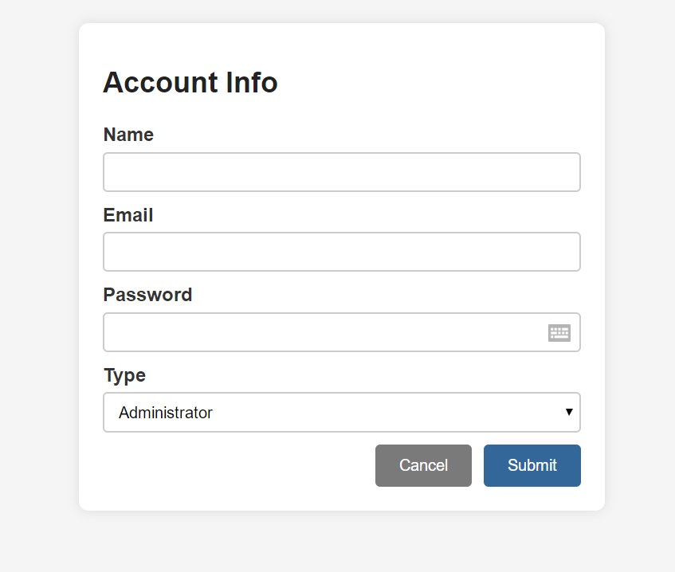
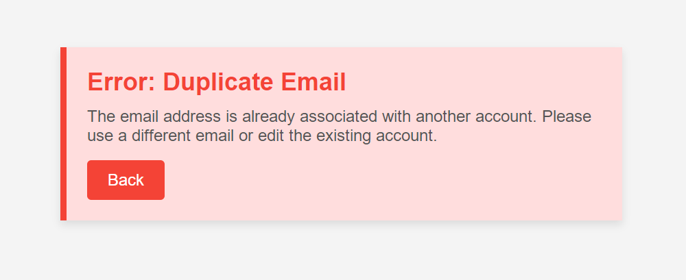
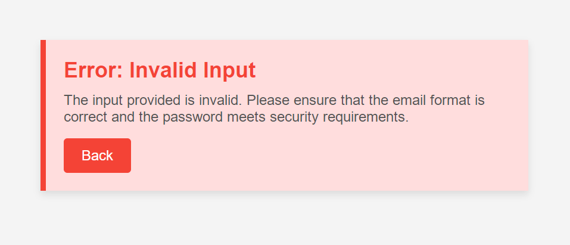

# 01 Create Account

## Basic Course of Events-- Creating User
- The administrator navigates to the 'View All Accounts' page, which displaying all existing accounts in the system.
- The system displays a list of existing accounts.
- The administrator selects 'New Account'.
- The administrator selects the type of account : User.
- The system presents a form for entering account information (Name, Email, Password).
- The administrator fills out the information.
- The system validates the change and updates this new user account.
- A confirmation message is shown to the administrator.
### Sequence Diagram

## Basic Course of Events-- Creating Organizer
- The administrator navigates to the 'View All Accounts' page, which displaying all existing accounts in the system.
- The system displays a list of existing accounts.
- The administrator selects 'New Account'.
- The administrator selects the type of account : Organizer.
- The system presents a form for entering account information (Name, Email, Password, Address, Company Name, Phone Number).
- The administrator fills out the information.
- The system validates the change and updates this new organizer account.
- A confirmation message is shown to the administrator.
### Sequence Diagram

## Basic Course of Events-- Creating Administrator
- The administrator navigates to the 'View All Accounts' page, which displaying all existing accounts in the system.
- The system displays a list of existing accounts.
- The administrator selects 'New Account'.
- The administrator selects the type of account : Administrator.
- The system presents a form for entering account information (Name, Email, Password).
- The administrator fills out the information.
- The system validates the change and updates this new administrator account.
- A confirmation message is shown to the administrator.
### Sequence Diagram

## Alternate Course of Events-- Duplicate Email Error
- The administrator navigates to the 'View All Accounts' page, which displaying all existing accounts in the system.
- The system displays a list of existing accounts.
- The administrator selects 'New Account'.
- The administrator selects the type of account : Administrator.
- The system presents a form for entering account information (Name, Email, Password).
- The administrator fills out the information.
- The administrator submits the form using an email that already exists in the system.
- The system displays an error message indicating that the email is already associated with another account.
- The system prompts the administrator to use a different email or to edit the existing account instead.
### Sequence Diagram

## Alternate Course of Events-- Invalid Input Error
- The administrator navigates to the 'View All Accounts' page, which displaying all existing accounts in the system.
- The system displays a list of existing accounts.
- The administrator selects 'New Account'.
- The administrator selects the type of account : Administrator.
- The system presents a form for entering account information (Name, Email, Password).
- The administrator fills out the information.
- The administrator submits the form with invalid data (e.g., improper email format, password not meeting security requirements).
- The system displays an error message explaining the issue (e.g., "Invalid email format" or "Password must contain at least 8 characters").
- The system prompts the administrator to correct the input and resubmit.
### Sequence Diagram

## UI Sketches
### Related UI Prototypes
！[Main Page](\eventmanagementsystem\02-analysis\UI\admin\01-view_all_events.png)

#### Duplicate Email Error

#### Invalide Input Error

