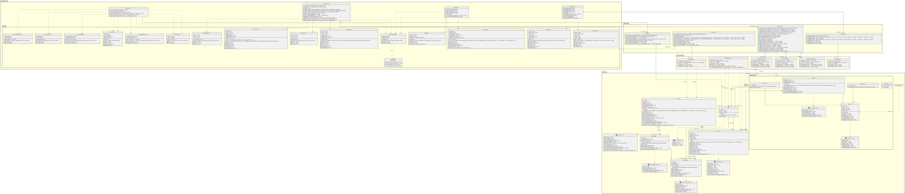

# Team Project: *Group 05*

## Team Members

| Number | Name        | Email(s)                  | CSGitLab Username |
|--------|-------------|---------------------------|-------------------|
| TM1    | Wang Shuhan | shuhan.wang@ucdconnect.ie | @WangShuhan       |
| TM2    | Gu Ruixin   | ruixin.gu@ucdconnect.ie   | @RuixinGu         |     
| TM3    | Rong Yuze   | yuze.rong@ucdconnect.ie   | @22207274         |     
| TM4    | An Ran      | ran.am@ucdconnect.ie      | @RanAnQWQ         |     
| TM5    | Li Siying   | siying.li@ucdconnect.ie   | @siying.li        |     
| TM6    | Shen Jinyan | jinyan.shen@ucdconnect.ie | @Shen_Jinyan      |     
| TM7    | Wan Zitong  | zitong.wan@ucdconnect.ie  | @Rostiute         |     
| TM8    | Qin Chenle  | chenle.qin@ucdconnect.ie  | @22207284         |

# Design

This phase continues the development process by performing further realisations on the courses of events that we
described in the analysis phase. This requires the creation of new sequence diagrams for each course of events. These
diagrams will be more detailed in that they will contain all parameter and type infromation. Additionally, the diagrams
will now include the UI and database components of the system.

Decisions made while constructing these diagrams are also documented in the class diagram.

## Use Case Realisations

The software includes the following use cases, grouped by topic for convenience. Each is defined in a separate markdown
file and is linked below.

1. [Login](/03-design/usecases/docs/00-login.md)
2. [View All Events](/03-design/usecases/docs/01-view_all_events.md)
3. [Delete Event](/03-design/usecases/docs/02-delete_event.md)
4. [View Event Details](/03-design/usecases/docs/03-view_event_details.md)
5. [View Event Registrations](/03-design/usecases/docs/04-view_event_registrations.md)
6. [Create Venue](/03-design/usecases/docs/05-create_venue.md)
7. [Edit Venue](/03-design/usecases/docs/06-edit_venue.md)
8. [View Venue Details](/03-design/usecases/docs/07-view_venue_details.md)
9. [Modify Account](/03-design/usecases/docs/08-modify_account.md)
10. [View Account](/03-design/usecases/docs/09-view_account.md)
11. [Search and Filter Events](/03-design/usecases/docs/10-search_filter_events.md)
12. [Display Date](/03-design/usecases/docs/11-display_date.md)
13. [Create Account](/03-design/usecases/docs/12-create_account.md)
14. [View All Accounts](/03-design/usecases/docs/13-view_all_accounts.md)
15. [Disable Account](/03-design/usecases/docs/14-disable_account.md)
16. [Delete Account](/03-design/usecases/docs/15-delete_account.md)
17. [Edit Account Permission](/03-design/usecases/docs/16-edit_account_permission.md)
18. [View All Venues](/03-design/usecases/docs/17-view_all_venues.md)
19. [Delete Venue](/03-design/usecases/docs/18-delete_venue.md)
20. [View Venue Usage History](/03-design/usecases/docs/19-view_venue_usage_history.md)
21. [View Events History](/03-design/usecases/docs/20-view_events_history.md)
22. [List My Events](/03-design/usecases/docs/21-list_my_events.md)
23. [Create Event](/03-design/usecases/docs/22-create_event.md)
24. [Edit Event](/03-design/usecases/docs/23-edit_event.md)
25. [List My Venues](/03-design/usecases/docs/24-list_my_venues.md)
26. [View Venue Bookings](/03-design/usecases/docs/25-view_venue_bookings.md)
27. [Register Account](/03-design/usecases/docs/26-register_account.md)
28. [List Upcoming Events](/03-design/usecases/docs/27-list_upcoming_events.md)
29. [Tickets List](/03-design/usecases/docs/28-tickets_list.md)
30. [Purchase Ticket](/03-design/usecases/docs/29-purchase_ticket.md)
31. [View Ticket Details](/03-design/usecases/docs/30-view_ticket_details.md)
32. [Cancel Ticket](/03-design/usecases/docs/31-cancel_ticket.md)

## Class Diagram

The class diagram represents the information gained about the system by completing the use case realisations.

[//]: # (这个不是最终的图,需要进一步调整)

## Data Persistence

[//]: # (这个也要改)
Within the restaurant the following classes should be maintained between executions.

1. Customer - id, name, phone number
2. Table - id, number, places
3. WalkIn - id, table, date, time, covers, is overfull
4. Reservation - id, customer, table, date, time, covers, is overfull

### Relationships

[//]: # (要改)

1. Customer - Reservation (1 to many)
2. Reservation - Customer (1 to 1)
2. Table - Booking (1 to many)
3. Booking - Table (1 to 1)

## Milestone 3 Design

### Distribution of work on this milestone

#### Overall Distribution of Work

| Team Member | TM1 | TM2 | TM3 | TM4 | TM5 | TM6 | TM7 | TM8 |
|-------------|-----|-----|-----|-----|-----|-----|-----|-----|
| Percentage  | 12% | 12% | 12% | 12% | 12% | 12% | 12% | 12% |

#### Task Allocation

Special note: the task of each use case includes: sequence diagrams(png and txt files).

| Item                                    | Primary Author | Contributor | Contributor | Reviewer |
|-----------------------------------------|----------------|-------------|-------------|----------|
| Modify use cases based on feedback      | TM             |             |             |          |
| Class Diagram                           | TM2&TM4&TM3    |             |             |          |
| Class Diagram Document                  | TM             |             |             |          |
| Final README file                       | TM7            |             |             |          |
| Use Case 00: "Login"                    | TM4            |             |             |          |
| Use Case 01: "View All Events"          | TM4            |             |             |          |
| Use Case 02: "Delete Event"             | TM4            |             |             |          |
| Use Case 03: "View Event Details"       | TM5            |             |             |          |
| Use Case 04: "View Event Registrations" | TM5            |             |             |          |
| Use Case 05: "Create Venue"             | TM5            |             |             |          |
| Use Case 06: "Edit Venue"               | TM5            |             |             |          |
| Use Case 07: "View Venue Details"       | TM3            |             |             |          |
| Use Case 08: "Modify Account"           | TM3            |             |             |          |
| Use Case 09: "View Account"             | TM3            |             |             |          |
| Use Case 10: "Search Filter Events"     | TM2            |             |             |          |
| Use Case 11: "Display date"             | TM1            |             |             |          |
| Use Case 12: "Create Account"           | TM8            |             |             |          |
| Use Case 13: "View All Accounts"        | TM8            |             |             |          |
| Use Case 14: "Disable Account"          | TM8            |             |             |          |
| Use Case 15: "Delete Account"           | TM8            |             |             |          |
| Use Case 16: "Edit Account Permission"  | TM8            |             |             |          |
| Use Case 17: "View All Venues"          | TM7            |             |             |          |
| Use Case 18: "Delete Venue"             | TM7            |             |             |          |
| Use Case 19: "View Venue Usage History" | TM7            |             |             |          |
| Use Case 20: "View Events History"      | TM7            |             |             |          |
| Use Case 21: "List My Events"           | TM6            |             |             |          |
| Use Case 22: "Create Event"             | TM6            |             |             |          |
| Use Case 23: "Edit Event"               | TM6            |             |             |          |
| Use Case 24: "List My Venues"           | TM6            |             |             |          |
| Use Case 25: "View Venue Bookings"      | TM6            |             |             |          |
| Use Case 26: "Register Account"         | TM1            |             |             |          |
| Use Case 27: "List Upcoming Events"     | TM1            |             |             |          |
| Use Case 28: "Tickets List"             | TM1            |             |             |          |
| Use Case 29: "Purchase Ticket"          | TM1            |             |             |          |
| Use Case 30: "View Ticket Details"      | TM2            |             |             |          |
| Use Case 31: "Cancel Ticket"            | TM2            |             |             |          |

#### Reflection Statements

| Team Member | Contribution Reflection Statement                                             |
|-------------|-------------------------------------------------------------------------------|
| TM1         | <*Required*: Completed the 11,26,27,28,29 use case. >                         |
| TM2         | <*Required*: Completed the 10,30,11 use case and class diagram.>              |
| TM3         | <*Required*: Completed the 07,08,09 use case and class diagram. >             |
| TM4         | <*Required*: Completed the 00,01,02 use case and class diagram. >             |
| TM5         | <*Required*: Completed the 03,04,05,06 use case. >                            |
| TM6         | <*Required*: Completed the 21,22,23,24,25 use case. >                         |
| TM7         | <*Required*: Completed the 17,18,19,20 use case and write basic README file.> |
| TM8         | <*Required*: Completed the 12,13,14,15,16 use case. >                         |

